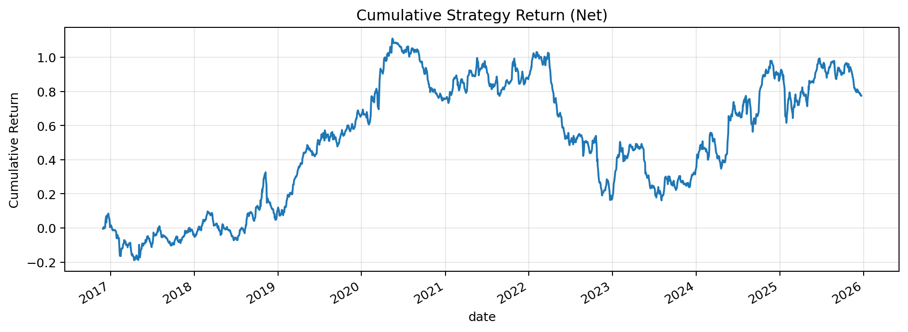
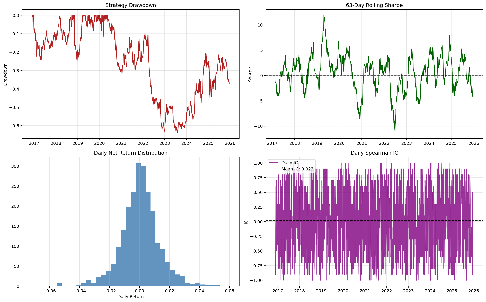
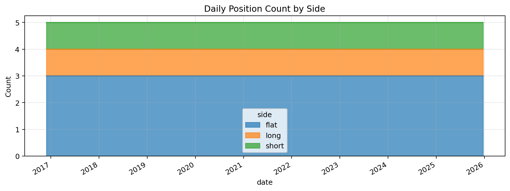

# Cross-Sectional Machine Learning Alpha for Equities

[](https://www.python.org/downloads/release/python-3100/)
[](https://www.postgresql.org/)
[](https://opensource.org/licenses/MIT)

## Executive Summary
This repository implements an end-to-end quantitative research pipeline for cross-sectional equity alpha.

The workflow ingests daily OHLCV bars, engineers stationarity-friendly cross-sectional factors, trains a walk-forward machine-learning model, and converts out-of-sample predictions into a dollar-neutral long-short portfolio.

The codebase is structured for production-minded research:
- Vectorized numerical operations in feature and portfolio steps.
- Strong input validation and type-safe interfaces.
- Defensive handling of NaN/Inf values before model training and backtesting.
- Step-by-step logging for traceability and debugging.
- Unit tests for core data, feature, model, and backtest modules.

## Research Objective
Given a daily universe of equities, estimate relative forward returns and monetize ranking quality via market-neutral portfolio construction.

Core question:
- Can engineered cross-sectional signals drive positive risk-adjusted out-of-sample returns while maintaining daily dollar neutrality?

## Pipeline Overview
1. Data ingestion
- Pull OHLCV bars from `yfinance`.
- Persist bars to SQL via SQLAlchemy ORM (`price_bars` table).
- Use PostgreSQL in normal operation; notebooks fall back to local SQLite when PostgreSQL is unavailable.

2. Feature engineering
- Build per-ticker features: short/medium momentum, moving-average distance, realized volatility, RSI, and volume change.
- Build forward return target for supervised learning.
- Apply daily cross-sectional z-score normalization to reduce regime-level scale distortion.

3. Model prototyping
- Use walk-forward `TimeSeriesSplit` on dates.
- Train tree-based regressor (`RandomForestRegressor` by default; XGBoost optional).
- Emit fully out-of-sample prediction table.

4. Portfolio construction and evaluation
- Long top quantile, short bottom quantile each day.
- Equal-weight each side and enforce dollar neutrality.
- Compute daily strategy returns and performance diagnostics.

## Repository Structure
```text
README.md
requirements.txt
data/
  processed/
  raw/
notebooks/
  01_database_setup_and_ingestion.ipynb
  02_feature_engineering.ipynb
  03_model_prototyping.ipynb
src/
  backtester.py
  config.py
  data_loader.py
  database.py
  features.py
  logging_utils.py
  models_db.py
  models_ml.py
tests/
  test_backtester.py
  test_database.py
  test_features.py
  test_models_ml.py
```

## Key Quant Components
### Features
Default model inputs (`DEFAULT_FEATURE_COLUMNS`):
- `ret_1d`, `ret_5d`, `ret_21d`
- `ma_dist_10`, `ma_dist_21`
- `vol_21d`
- `rsi_14`
- `vol_chg_5d`

### Target
Forward return over horizon `h`:
\[
\text{target\_fwd\_return}_{i,t} = \frac{P_{i,t+h}}{P_{i,t}} - 1
\]

### Cross-Sectional Normalization
For each day \(t\), each feature is standardized cross-sectionally:
\[
Z_{i,t} = \frac{f_{i,t}-\mu_t}{\sigma_t}
\]

### Portfolio Rule
For each date:
- Long the top `q` quantile by prediction.
- Short the bottom `q` quantile by prediction.
- Assign equal magnitude weights per side.

Daily PnL:
\[
R_t = \sum_i w_{i,t} \cdot r_{i,t}^{\text{realized}}
\]

## Logging and Observability
The project uses Python `logging` with timestamped structured messages.

Logging now reports:
- Data ingestion size and universe coverage.
- SQL load/upsert counts.
- Feature computation stages and usable row counts.
- Walk-forward fold-level train/test sizes.
- Prediction counts and performance summary completion.

Notebook logs provide explicit step markers (for example, "Step 3/5") so runtime progress is auditable in sequence.

## Visual Diagnostics (Notebook 03)
The model prototyping notebook now includes multiple resume-ready diagnostics:
- Cumulative strategy return.
- Drawdown time series.
- 63-day rolling Sharpe.
- Daily return distribution histogram.
- Daily Spearman IC time series (with average IC reference line).
- Daily position count by side (long/short/flat area chart).

These plots are useful for discussing signal quality, risk profile, and implementation realism in interviews.

### Results Snapshot

#### Cumulative Return Curve


Small summary:
- The strategy shows long-run positive drift in cumulative returns.
- Return path is non-monotonic, highlighting realistic regime variation and model cyclicality.

#### Risk and Signal Diagnostics (2x2)


Small summary:
- Drawdown panel quantifies tail-risk episodes and recovery behavior.
- Rolling Sharpe demonstrates time-varying risk-adjusted performance across regimes.
- Return histogram is centered near zero with visible positive and negative tails, consistent with long-short daily PnL.
- Daily Spearman IC oscillates around a positive average, indicating modest but persistent ranking signal.

#### Position Construction Stability


Small summary:
- Daily side counts are stable and consistent with deterministic quantile-based construction.
- This confirms reproducible exposure mechanics (long/short/flat allocation process).

## Getting Started
### 1) Environment setup
```bash
python -m venv .venv
.venv\Scripts\activate
pip install -r requirements.txt
```

### 2) Run tests
```bash
pytest -q
```

### 3) Run notebooks in order
1. `notebooks/01_database_setup_and_ingestion.ipynb`
2. `notebooks/02_feature_engineering.ipynb`
3. `notebooks/03_model_prototyping.ipynb`

If PostgreSQL is not running locally, notebooks automatically switch to:
- `sqlite+pysqlite:///data/processed/quant_alpha_local.db`

## Configuration
Environment variables (see `src/config.py`):
- `DATABASE_URL`
- `UNIVERSE`
- `START_DATE`
- `END_DATE`
- `PREDICTION_HORIZON_DAYS`
- `TOP_BOTTOM_QUANTILE`
- `RANDOM_STATE`

Validation rules are enforced at startup (date ordering, positive horizon, valid quantile range, non-negative random state).

## Production-Grade Safeguards Implemented
- Vectorized transformations for features and portfolio construction.
- Input-schema validation for critical tables/dataframes.
- Numeric coercion and NaN/Inf sanitation before model and PnL math.
- Positive-price and non-negative-volume guardrails where required.
- Deterministic output schemas on empty-path execution.
- Fold-aware walk-forward testing behavior and model-data validation.

## Testing Coverage
Current tests validate:
- Database table lifecycle and upsert/load behavior.
- Feature generation and cleaning assumptions.
- Model training and walk-forward prediction integrity.
- Portfolio weighting, return aggregation, and performance summary outputs.
- Error/validation paths for missing columns, invalid parameters, and non-finite data.

## Limitations and Next Steps
Potential upgrades:
- Add transaction cost and slippage model.
- Add turnover constraints and capacity analysis.
- Add benchmark-relative diagnostics and factor exposure decomposition.
- Replace simple equal-weighting with risk-targeted optimizer.
- Add CI pipeline for tests, linting, and notebook smoke checks.

## License
MIT
